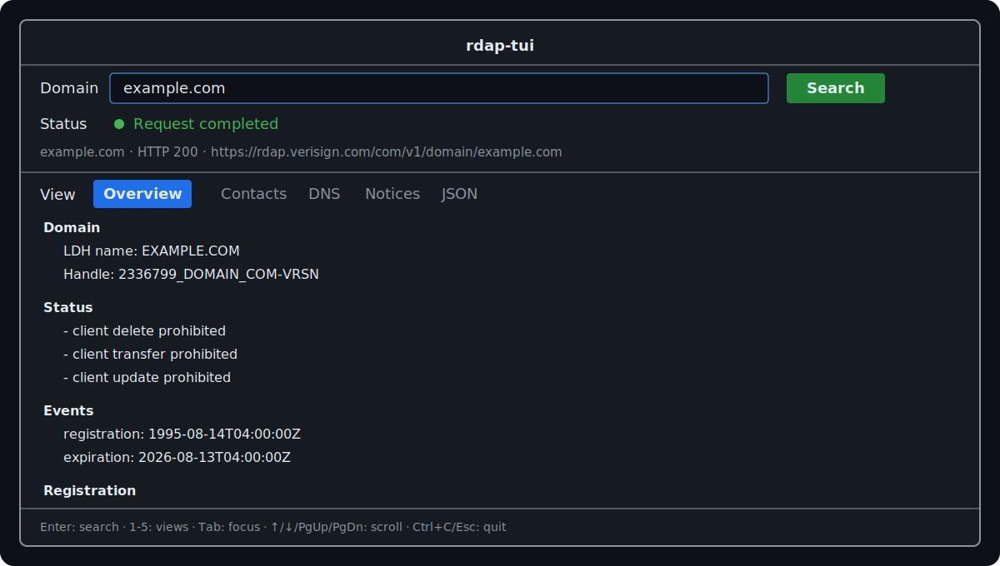

# rdap-tui

`rdap-tui` is an open-source terminal client for the Registration Data Access Protocol (RDAP).
The Domain MVP supports interactive lookups with structured registration, contact, DNS, notice,
and JSON views. Discovery uses the IANA bootstrap registry and requests use verified HTTPS.



## Requirements

- C++20 compiler: GCC 13+, Clang 18+, or AppleClang 16+
- CMake 3.25+
- Conan 2.26+

## Build

```sh
# One-time setup only, if no Conan default profile exists:
# conan profile detect
conan lock create . --lockfile-out=conan.lock -s compiler.cppstd=20
conan install . --build=missing -s build_type=Release -s compiler.cppstd=20
cmake --preset conan-release
cmake --build --preset conan-release
ctest --preset conan-release
```

Run the executable generated under `build/Release/`:

```sh
./build/Release/rdap-tui
```

Conan also generates a `conan-debug` preset when installed with
`-s build_type=Debug`.

## Usage

Enter an ASCII domain or Punycode A-label and press Enter. The result is split into five views:
Overview, Contacts, DNS, Notices, and JSON. Press 1–5 to switch views while the domain field is not
focused. The JSON view retains both a pretty-printed document and the byte-preserving response.

Use Tab to move between controls, arrow keys or Page Up/Page Down to scroll, and Ctrl+C or Escape
to quit.

```text
rdap-tui [--help] [--version]
```

Malformed optional fields do not hide valid registration data: the structured projection reports
warnings in the Notices view, while the complete response remains available under JSON.

Unicode-to-IDNA conversion, IP/ASN lookups, persistent caching, and binary packages remain outside
the Domain MVP.

## Optional network smoke test

Normal tests never access the Internet. To build the explicit smoke test:

```sh
conan install . --build=missing -s build_type=Debug -s compiler.cppstd=20 \
  -o '&:network_tests=True'
cmake --preset conan-debug -DRDAP_ENABLE_NETWORK_TESTS=ON
cmake --build --preset conan-debug
ctest --preset conan-debug -L network --output-on-failure
```

The smoke test contacts IANA and the authoritative service for `example.com`; external outages
or rate limiting can therefore make it fail.

## Standards and security

Discovery follows [RFC 9224](https://www.rfc-editor.org/rfc/rfc9224.html), query URLs follow
[RFC 9082](https://www.rfc-editor.org/rfc/rfc9082.html), and responses follow
[RFC 9083](https://www.rfc-editor.org/rfc/rfc9083.html). TLS verification is mandatory and
redirects are restricted to HTTPS.

See [CONTRIBUTING.md](CONTRIBUTING.md) for development checks and [SECURITY.md](SECURITY.md) for
reporting vulnerabilities.

## License

Copyright © 2026 rdap-tui contributors.

Licensed under GPL-3.0-or-later. See [LICENSE](LICENSE).
